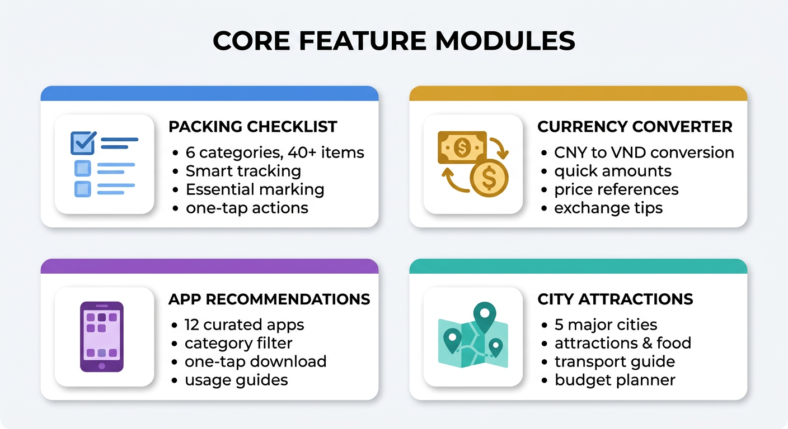
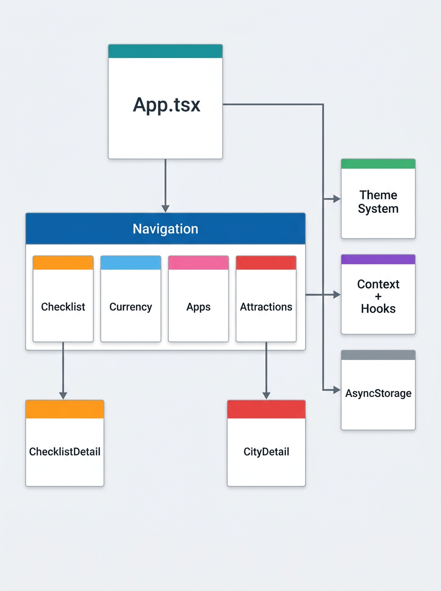
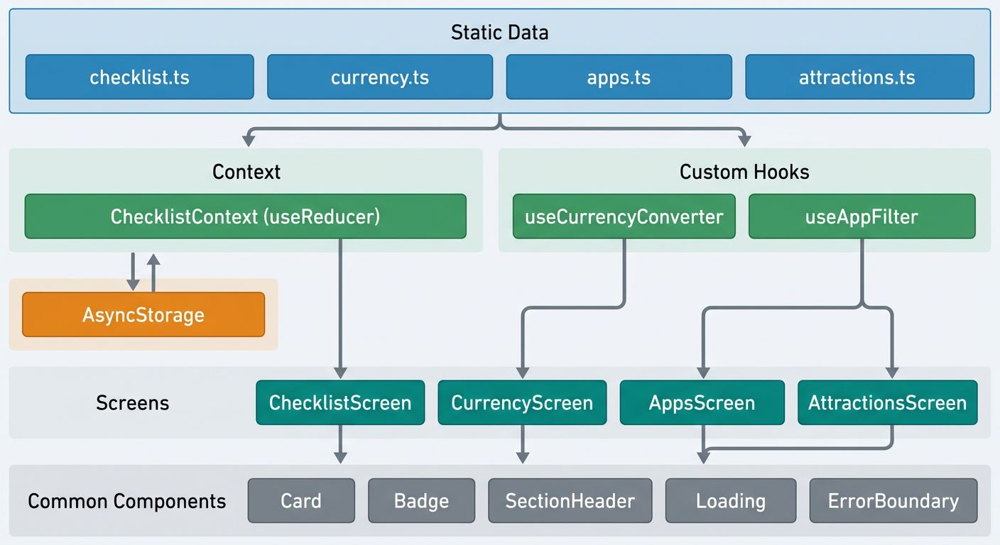
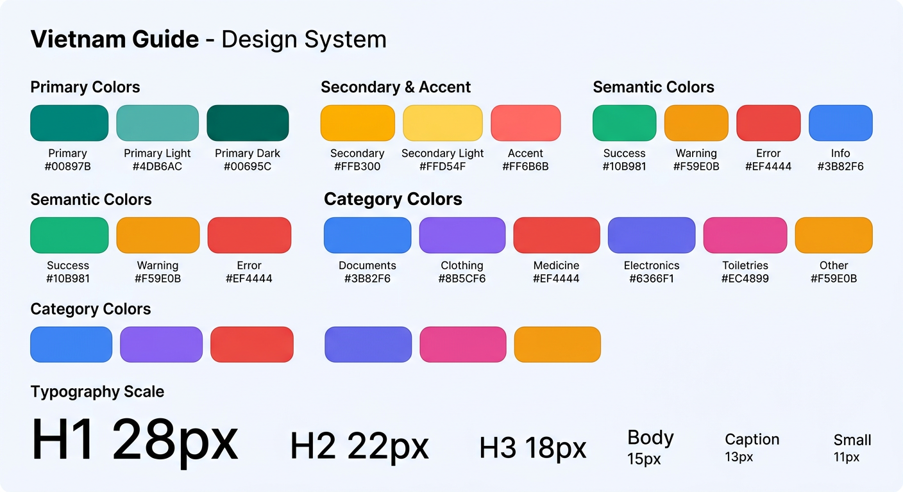
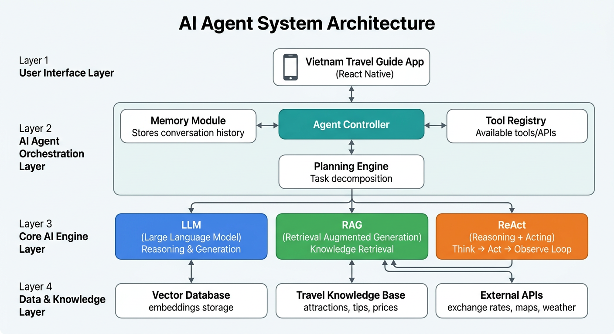
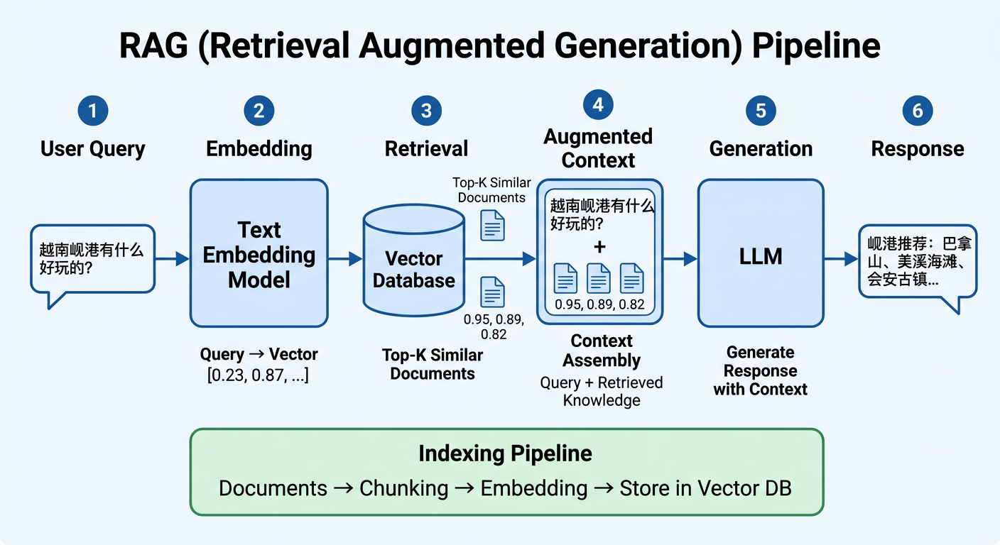
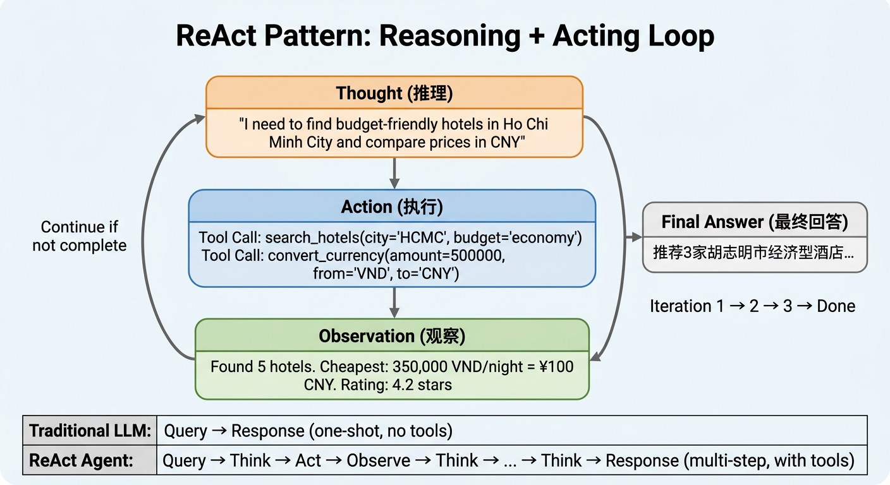
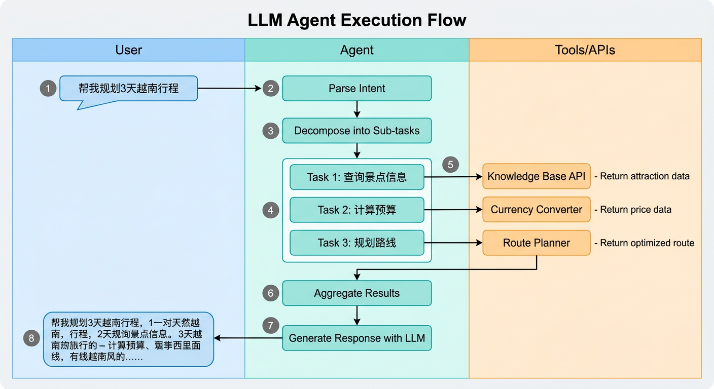

# 越南旅游指南 (Vietnam Travel Guide)

一站式越南旅游指南原生移动应用，为中国游客量身打造，帮助您轻松规划越南之旅。

## 功能模块



### 1. 🎒 越南必备物品
- **6大分类**：证件类、衣物类、药品类、电子设备、洗漱用品、其他物品
- **40+物品清单**：每个物品都有详细说明和实用小贴士
- **智能追踪**：勾选状态本地持久化，永不丢失
- **必备标注**：关键物品高亮提醒，避免遗漏
- **一键操作**：全选/清除，快速管理

### 2. 💰 越南金钱换算
- **实时换算**：输入人民币金额，自动计算越南盾
- **快捷金额**：常用金额一键转换 (100/500/1000等)
- **物价参考**：12项常见消费参考 (咖啡、米粉、出租车等)
- **换钱攻略**：银行、ATM、金店换汇技巧

### 3. 📱 常用软件推荐
- **12款精选App**：Grab、Google Maps、Booking、Agoda等
- **分类筛选**：交通/导航/住宿/支付/通讯/美食/工具
- **一键下载**：直接跳转 App Store / Google Play
- **使用技巧**：每款App都有详细使用指南

### 4. 🏖️ 景点攻略
- **5大热门城市**：胡志明市、河内、岘港、芽庄、富国岛
- **每城包含**：
  - 热门景点 (评分、门票、开放时间、小贴士)
  - 美食推荐 (价格、特色、必点)
  - 交通指南 (机场到市区、市内交通)
  - 预算参考 (经济/中等/舒适三档)

## 架构设计

### 应用架构



应用采用分层架构，从上到下依次为：
- **入口层**：App.tsx 初始化 Providers（SafeAreaProvider → ErrorBoundary → ChecklistProvider → NavigationContainer）
- **导航层**：Bottom Tab Navigator + Native Stack Navigator
- **页面层**：4个主屏幕 + 2个详情页
- **支撑层**：主题系统、Context状态管理、AsyncStorage持久化

### 数据流



```
静态数据 (src/data/) → Context / Hooks → Screens → Common Components
                 ↕
           AsyncStorage (持久化)
```

- **数据层**：所有旅游数据为静态数据，无需网络请求
- **状态管理**：React Context + useReducer 管理清单勾选状态
- **持久化**：AsyncStorage 自动保存/恢复清单进度
- **业务逻辑**：自定义 Hooks (useCurrencyConverter, useAppFilter) 封装计算与筛选逻辑

### 导航结构

```
RootNavigator (Bottom Tab)
├── ChecklistTab → ChecklistStack
│   ├── ChecklistScreen (分类列表)
│   └── ChecklistDetailScreen (物品清单)
├── CurrencyTab → CurrencyScreen (汇率换算)
├── AppsTab → AppsScreen (软件推荐)
└── AttractionsTab → AttractionsStack
    ├── AttractionsScreen (城市列表)
    └── CityDetailScreen (城市详情)
```

## 设计系统



| 类别 | 说明 |
|------|------|
| 主色调 | Teal (#00897B) — 越南风格 |
| 辅助色 | Amber (#FFB300) — 进度/评分 |
| 强调色 | Red (#FF6B6B) — 必备标注 |
| 字体 | iOS: PingFang SC / Android: 系统默认 |
| 间距 | 4px 基础单位，8级渐变 (4-40px) |
| 圆角 | 5级 (6/10/14/20/999px) |
| 阴影 | iOS: Shadow / Android: Elevation |

## AI Agent 架构设计

本项目以越南旅游场景为载体，探索 AI Agent 的核心架构与执行模式。

### 系统架构总览



Agent 系统采用四层架构：

| 层级 | 职责 | 关键组件 |
|------|------|----------|
| **用户界面层** | 接收用户输入，展示响应 | React Native App |
| **Agent 编排层** | 任务规划、记忆管理、工具调度 | Agent Controller, Memory, Tool Registry, Planning Engine |
| **AI 引擎层** | 推理、检索、决策 | LLM, RAG, ReAct |
| **数据与知识层** | 存储与外部接口 | Vector DB, Knowledge Base, External APIs |

**核心设计原则**：Agent Controller 作为中枢，接收用户请求后通过 Planning Engine 将复杂任务拆解为子任务，再调用 LLM/RAG/ReAct 等引擎协同完成。Memory Module 保持上下文连续性，Tool Registry 管理可用工具集。

### RAG 检索增强生成



RAG 解决了 LLM "知识截止"和"幻觉"问题，通过外部知识库增强生成质量：

**在线查询流程** (Query Time):
1. **User Query** — 用户提问，如"越南岘港有什么好玩的？"
2. **Embedding** — 将问题通过 Embedding 模型转为向量 `[0.23, 0.87, ...]`
3. **Retrieval** — 在 Vector Database 中检索 Top-K 相似文档（余弦相似度排序）
4. **Context Assembly** — 将原始问题与检索到的文档片段拼接为增强上下文
5. **Generation** — LLM 基于增强上下文生成准确、有据可依的回答
6. **Response** — 返回包含真实景点数据的推荐结果

**离线索引流程** (Index Time):
```
原始文档 → 文本分块 (Chunking) → 向量化 (Embedding) → 存入 Vector DB
```

**关键参数**：
- `chunk_size`: 文档分块大小（通常 256-1024 tokens）
- `top_k`: 检索返回的文档数量（通常 3-5）
- `similarity_threshold`: 相似度阈值（过滤低质量结果）

### ReAct 推理-行动循环



ReAct (Reasoning + Acting) 是 Agent 的核心执行模式，让 LLM 通过**交替推理与行动**来完成复杂任务：

**循环三阶段**：

| 阶段 | 英文 | 说明 | 示例 |
|------|------|------|------|
| **推理** | Thought | LLM 分析当前状态，决定下一步 | "需要查找胡志明市经济型酒店并换算价格" |
| **执行** | Action | 调用外部工具获取信息 | `search_hotels(city='HCMC')`, `convert_currency(...)` |
| **观察** | Observation | 接收工具返回结果 | "找到5家酒店，最便宜350,000 VND/晚 = ¥100" |

循环持续直到 Agent 判断信息充足，输出最终回答。

**对比传统 LLM**：
```
Traditional LLM:  Query → Response                          (单次推理，无工具)
ReAct Agent:      Query → Think → Act → Observe → ... →    Response (多步推理，有工具)
```

### Agent 执行流程



以"帮我规划3天越南行程"为例，展示 Agent 的完整执行泳道：

1. **意图解析** — Agent 识别用户意图为"行程规划"
2. **任务分解** — Planning Engine 将其拆解为 3 个子任务：
   - Task 1: 查询景点信息 → Knowledge Base API
   - Task 2: 计算预算 → Currency Converter
   - Task 3: 规划路线 → Route Planner
3. **并行执行** — 子任务可并行调用不同 Tools/APIs
4. **结果聚合** — 将各工具返回数据整合
5. **LLM 生成** — 基于聚合结果生成自然语言行程方案

### 核心概念对照

| 概念 | 全称 | 核心思想 | 本项目应用 |
|------|------|----------|------------|
| **LLM** | Large Language Model | 通过海量文本训练的语言理解与生成模型 | 理解用户旅游需求，生成个性化建议 |
| **RAG** | Retrieval Augmented Generation | 检索外部知识增强生成准确性 | 从景点/美食/交通知识库检索实时数据 |
| **ReAct** | Reasoning + Acting | 交替推理与行动的循环模式 | 多步骤行程规划（查→算→排→答） |
| **Tool Use** | Function Calling | LLM 调用外部工具扩展能力 | 汇率 API、地图服务、酒店搜索 |
| **Memory** | Context Management | 维护对话历史与用户偏好 | 记住用户预算偏好、已访问城市 |
| **Planning** | Task Decomposition | 将复杂任务拆解为可执行子任务 | 3天行程 → 每日景点+餐饮+交通 |

## 技术栈

| 技术 | 版本 | 用途 |
|------|------|------|
| React Native | 0.84.0 | 跨平台移动开发框架 |
| TypeScript | 5.8+ | 类型安全 |
| React Navigation | 7.x | 导航管理 |
| AsyncStorage | 2.x | 本地数据持久化 |
| Vector Icons | 10.x | 图标库 (Ionicons) |
| Jest | 29.x | 单元测试 |

## 项目结构

```
vietnam-agent/
├── App.tsx                     # 应用入口
├── src/
│   ├── components/common/      # 通用组件
│   │   ├── Card.tsx           # 卡片容器
│   │   ├── Badge.tsx          # 标签徽章
│   │   ├── SectionHeader.tsx  # 区块标题
│   │   ├── ErrorBoundary.tsx  # 错误边界
│   │   └── Loading.tsx        # 加载状态
│   ├── constants/              # 常量定义
│   │   └── strings.ts         # 中文字符串
│   ├── context/                # 全局状态
│   │   └── ChecklistContext.tsx
│   ├── data/                   # 静态数据
│   │   ├── checklist.ts       # 清单数据
│   │   ├── currency.ts        # 汇率数据
│   │   ├── apps.ts            # App推荐数据
│   │   └── attractions.ts     # 景点数据
│   ├── hooks/                  # 自定义Hooks
│   │   ├── useCurrencyConverter.ts
│   │   └── useAppFilter.ts
│   ├── navigation/             # 导航配置
│   │   ├── RootNavigator.tsx
│   │   └── types.ts
│   ├── screens/                # 页面组件
│   │   ├── checklist/         # 必备物品
│   │   ├── currency/          # 金钱换算
│   │   ├── apps/              # 常用软件
│   │   └── attractions/       # 景点攻略
│   ├── theme/                  # 主题系统
│   │   ├── colors.ts          # 颜色定义
│   │   ├── typography.ts      # 字体样式
│   │   ├── spacing.ts         # 间距规范
│   │   └── shadows.ts         # 阴影效果
│   ├── types/                  # 类型定义
│   └── utils/                  # 工具函数
│       ├── formatCurrency.ts  # 货币格式化
│       ├── storage.ts         # 存储工具
│       └── openLink.ts        # 链接工具
├── __tests__/                  # 测试文件
├── android/                    # Android 原生代码
├── ios/                        # iOS 原生代码
├── docs/images/                # 文档图示
└── .github/workflows/          # CI/CD 配置
```

## 快速开始

### 环境要求

| 依赖 | 版本 |
|------|------|
| Node.js | >= 22.11.0 |
| JDK | 17 (Android) |
| Xcode | 15+ (iOS, macOS only) |
| Android SDK | API 34+ |

### 安装

```bash
# 克隆项目
git clone https://github.com/ava-agent/vietnam-agent.git
cd vietnam-agent

# 安装依赖
npm install

# iOS 需要安装 Pods
cd ios && pod install && cd ..
```

### 运行

```bash
# Android
npm run android

# iOS
npm run ios

# 启动开发服务器
npm start
```

### 测试

```bash
# 运行所有测试
npm test

# TypeScript 类型检查
npx tsc --noEmit

# ESLint 代码规范检查
npm run lint
```

## 构建发布

### Android Release APK

```bash
# 1. 配置签名 (首次)
# 编辑 android/gradle.properties 添加:
VIETNAM_RELEASE_STORE_FILE=vietnam-release.keystore
VIETNAM_RELEASE_STORE_PASSWORD=your-password
VIETNAM_RELEASE_KEY_ALIAS=vietnam-guide
VIETNAM_RELEASE_KEY_PASSWORD=your-password

# 2. 构建
cd android && ./gradlew assembleRelease

# 3. 输出位置
# android/app/build/outputs/apk/release/app-release.apk
```

### iOS Release

```bash
# 使用 Xcode 构建
# 1. 打开 ios/VietnamGuide.xcworkspace
# 2. 选择 Product > Archive
# 3. 上传到 App Store Connect
```

## CI/CD

项目配置了 GitHub Actions 自动化流水线：

| 触发条件 | 执行操作 |
|----------|----------|
| 推送到 main | 构建 APK + 运行测试 |
| 创建 Tag (v*) | 发布 GitHub Release + 上传 APK |
| Pull Request | TypeScript 检查 + Jest 测试 |

### 配置 GitHub Secrets

在仓库 Settings → Secrets 中添加：

| Secret | 说明 |
|--------|------|
| RELEASE_KEYSTORE_BASE64 | keystore 文件的 base64 编码 |
| RELEASE_STORE_PASSWORD | keystore 密码 |
| RELEASE_KEY_ALIAS | 密钥别名 |
| RELEASE_KEY_PASSWORD | 密钥密码 |

## 代码质量

| 指标 | 状态 |
|------|------|
| TypeScript | ✅ 零错误 |
| ESLint | ✅ 零警告 |
| Jest 测试 | ✅ 33/33 通过 |
| 无障碍支持 | ✅ accessibilityRole/Label |
| 性能优化 | ✅ useCallback/useMemo |

## 更新日志

### v1.0.0 (2026-03-03)
- 🎉 首次发布
- ✨ 四大核心模块：必备物品、金钱换算、常用软件、景点攻略
- 🎨 越南风格主题设计
- 📱 支持 iOS 和 Android
- 🌐 完整中文化

## 贡献指南

欢迎提交 Issue 和 Pull Request！

1. Fork 本仓库
2. 创建特性分支 (`git checkout -b feature/AmazingFeature`)
3. 提交更改 (`git commit -m 'Add some AmazingFeature'`)
4. 推送到分支 (`git push origin feature/AmazingFeature`)
5. 创建 Pull Request

## License

MIT License - 详见 [LICENSE](LICENSE) 文件

---

<p align="center">
  Made with ❤️ for Vietnam travelers
</p>
